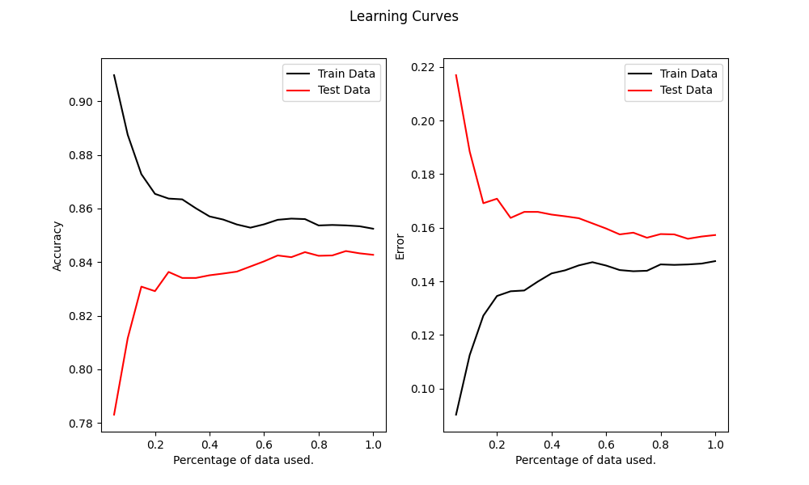

# Binary Sentiment Classification

In this project three machine learning algorithms (Naive Bayes, ID3 & Ada Boost) have been implemented for the classification of movie reviews as either positive or negative.

For the training and testing of the algorithms the "Large Movie Review Dataset", also known as "IMDB dataset", has been used which can be found [here](https://ai.stanford.edu/~amaas/data/sentiment/). In order for the code to work simply download it from the link provided and import it in the project file.

In this implementation every review text is represented by a binary vector, which shows which words from a vocabulary are contained in each review. For the definition of the vocabulary, an information gain algorithm is used that selects the most appropriate words.

The learning curves of the algorithms are shown below.

## Naive Bayes Learning Curves

## ID3 Learning Curves

## AdaBoost Learning Curves

